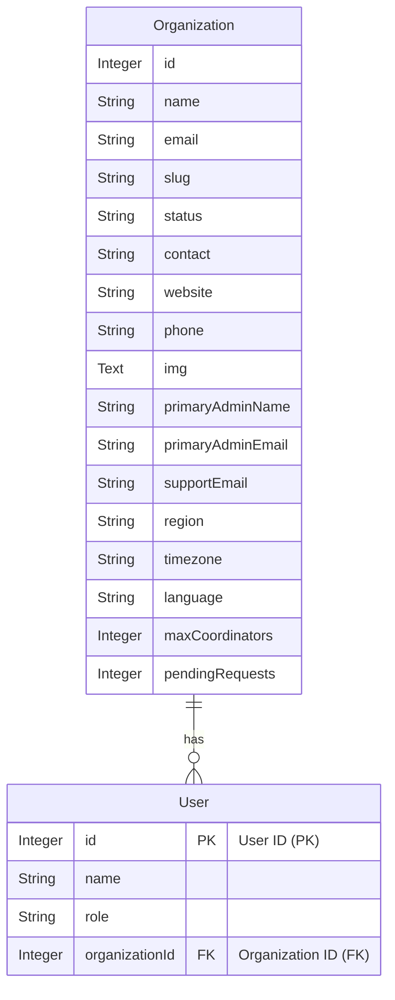

# B2B Organization Management Dashboard

This is a full-stack web application designed for managing B2B (Business-to-Business) organizations and their associated users. It features a React frontend for a clean, interactive user experience and a Node.js/Express backend powered by a PostgreSQL database for robust data management.

The application provides a central platform for administrators to perform CRUD (Create, Read, Update, Delete) operations on organizations, manage user roles within those organizations, and view high-level analytics on a dashboard.

**Frontend Demo:** [https://b2b-dashboard-jade-nu.vercel.app/](https://b2b-dashboard-jade-nu.vercel.app/)
**Backend API:** [https://b2b-dashboard-9725.onrender.com/api](https://b2b-dashboard-9725.onrender.com/api)

## Features

  * **Dashboard Analytics**: A high-level dashboard displaying a bar chart of user counts per organization.
  * **Organization Management**: Full CRUD functionality for B2B organizations.
      * View a list of all organizations with their status and pending requests.
      * Create new organizations via a slide-out modal.
      * View and edit detailed organization profiles, including contact info, settings, and branding (logo upload).
      * Change an organization's status (Active, Inactive, Blocked).
      * Delete organizations.
  * **User Management**: Manage users scoped to a specific organization.
      * View a list of all users within an organization.
      * Add new users (Admin, Co-ordinator) to an organization.
      * Edit existing user details.
      * Delete users from an organization.
  * **Image Uploads**: Supports uploading organization logos as Base64-encoded strings, allowing for efficient storage directly in the database.
  * **Responsive UI**: Built with React Bootstrap, the interface is designed to work smoothly on both desktop and mobile devices.
  * **Component-Based Design**: Features reusable React components for modals, forms, status pills, and layout, ensuring a consistent look and feel.

## Tech Stack

### Backend

  * **Runtime**: Node.js
  * **Framework**: Express.js
  * **Database**: PostgreSQL
  * **ORM**: Sequelize
  * **API**: RESTful API design
  * **Middleware**: CORS
  * **Environment**: `dotenv` for environment variable management

### Frontend

  * **Framework**: React.js
  * **Bundler**: Vite
  * **Routing**: React Router DOM
  * **UI Library**: React Bootstrap & Bootstrap 5
  * **API Client**: Axios
  * **Charting**: Recharts
  * **Icons**: Lucide React

## Database Schema (ER Diagram)



## Getting Started

To get a local copy up and running, follow these steps.

### Prerequisites

  * Node.js (v18 or newer recommended)
  * npm (or yarn)
  * A running PostgreSQL database server

### 1\. Backend Setup

1.  **Clone the repository:**

    ```sh
    git clone https://github.com/your-username/b2b-dashboard.git
    cd b2b-dashboard/Backend
    ```

2.  **Install dependencies:**

    ```sh
    npm install
    ```

3.  **Set up environment variables:**
    Create a file named `.env` in the `Backend` directory and add your PostgreSQL database credentials:

    ```.env
    DB_DIALECT="postgres"
    DB_HOST="localhost"
    DB_USER="your_postgres_user"
    DB_PASSWORD="your_postgres_password"
    DB_NAME="b2b-dashboard" # Make sure you create this database
    DB_PORT="5432"
    DB_SSL="false" # Set to 'true' if connecting to a cloud DB with SSL
    ```

4.  **Run the server:**
    The server will connect to the database, sync the models (creating tables if they don't exist), and start listening.

    ```sh
    npm run dev
    ```

    The backend API will be running at `http://localhost:3001`.

### 2\. Frontend Setup

1.  **Open a new terminal** and navigate to the `Frontend` directory:

    ```sh
    cd ../Frontend
    ```

2.  **Install dependencies:**

    ```sh
    npm install
    ```

3.  **Run the development server:**

    ```sh
    npm run dev
    ```

4.  **Open the app:**
    Open [http://localhost:5173](https://www.google.com/search?q=http://localhost:5173) (or the port specified in your terminal) to view the application in your browser.
